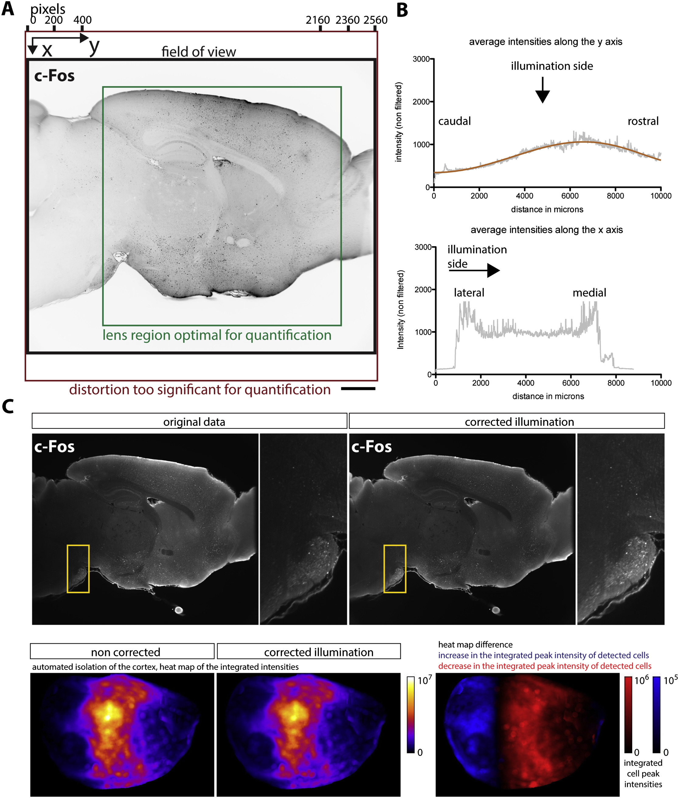

CellMap
=======

This pipeine implements the cell detection and analysis done in [Renier2016]_.

See the :ref:`CellMap tutorial </CellMap.ipynb>` for usage.

The main image processing steps are defined in the cell expert
:mod:`ClearMap.ImageProcessing.Experts.Cells`.

Pipeline
--------

:mod:`~ClearMap.Scripts.CellMap` is tailored to detect  cell nuclei 
and composed of the following image processing steps:

* `Illumination correction`_

* `Background removal`_

* `Equalization`_

* `Difference of Gaussians (DoG) filter`_

* `Maxima detection`_

* `Cell shape detection`_

* `Cell intensity measurements`_

In short background subtraction via morphological opening is followed by a 
sequence of filters, morphological operations and a 3D peak detection. 
The peaks are used as seeds for a watershed on the foreground and
the resulting shapes filtered by volume to retain only genuine cells.

.. _CellMapPipeline:

.. figure:: Static/CellMap_pipeline.png

  iDISCO+ and ClearMap: A Pipeline for Cell Detection, Registration, and 
  Mapping in Intact Samples Using Light Sheet Microscopy.

Illumination correction
^^^^^^^^^^^^^^^^^^^^^^^

To improve the consistency of the cell detection algorithm, we pre-process the
light sheet images by correcting illumination along the y axis (orthogonal to 
the direction of illumination) to account for light loss due to the objective 
lens vignetting and Gaussian shape of the light sheet beam.

Because of the Gaussian shape of the light sheet and of the objecting lens 
vignetting, the sample illumination is not uniform. While correcting the 
illumination can improve the uniformity of the cell detection, it is often 
not necessary if all samples where imaged the same way, as the anatomical 
features will be positioned in the same region of the lens across samples.

.. Note::
  
  Please note that you need to generate an intensity profile for your system 
  if you wish to use this function.

.. _CellMapPipelineIllumination:

  Illumination correction in ClearMap.

Background removal
^^^^^^^^^^^^^^^^^^
This is the most important pre-processing step, usually always turned on. 
The background subtraction is done by subtracting a morphological opening
and is not very sensitive to the size parameter used, as long as it is in the 
range of the size of the objects detected.

Equalization
^^^^^^^^^^^^

In this step a custom designed equalization filter is applied optionally.
The filter calculates for each voxel :math:`i` a lower and upper 
intensity (:math:`l_{i}` and :math:`u_{i}`)
via a lower and upper percentile (:math:`p_{l}` and :math:`p_{u}`) of
the voxel intensities in a rectangular region :math:`R_{i}` centered
around :math:`i`. The region is chosen to be larger than the large
vessel structures and our efficient histogram sampling framework is used
to speed up computation. The voxel intensity is then normalized via

.. math:: v_{i} \rightarrow f_{i}v_{i}

with normalization factor

.. math:: f_{i} = \left\{ \begin{array}{ll} v_{i}/l_{i} & u_{i}/l_{i} \leq m \\ m/u_{i} & \text{else} \end{array} \right.

and :math:`m` a maximal intensity value for the upper percentile.

Difference of Gaussians (DoG) filter
^^^^^^^^^^^^^^^^^^^^^^^^^^^^^^^^^^^^

This is an optional filter improves the contrast of blob like objects.
This filter has a "Mexican Hat" shape that negatively weighs the intensity
at the border of the objects.

A c-Fos nuclear staining often has enough contrast and a simple shape 
so this additional filtering is not necessary usually, but it can help
to increase the contrast of the relevant objects for other experiments.

Maxima detection
^^^^^^^^^^^^^^^^

In this step potentiall cell centers are detect by finding local maxima
in the pre-processed images. 

The maxima detection can have an optional extended maxima filter (via
an h-transform) usefull for objects that contain several peaks of intensity,
for instance, higher resolution views of a cell nuclei with granular texture. 

Cell shape detection
^^^^^^^^^^^^^^^^^^^^

The cell shape detection can be used to measure the volmues of the detected 
cells. This can help to remove local peaks that do not correspond to an actual 
cell.

The shape detection is done by a watershed, which will paint the volume 
of the cell from the detected center outwards. 

Cell intensity measurements
^^^^^^^^^^^^^^^^^^^^^^^^^^^

This part of the pipeline allows to measure various expression levels and 
intensities given the cell centers or shape. Different methods
can be used to calculate the intensity in an extened cell shape (e..g max, min,
mean etc.).

Statistics
^^^^^^^^^^

Cell counts or intensities of each sample in considered regions or annotated
brain areas between different groups can be compared using the independent
two sample student t-test assuming unequal variances. 

ClearMap as a discovery tool also provides correction for p-values for multiple 
comparison to q-values to control for false-discovery rate.

See the :mod:`ClearMap.Analysis.Statistics` module for more details.
