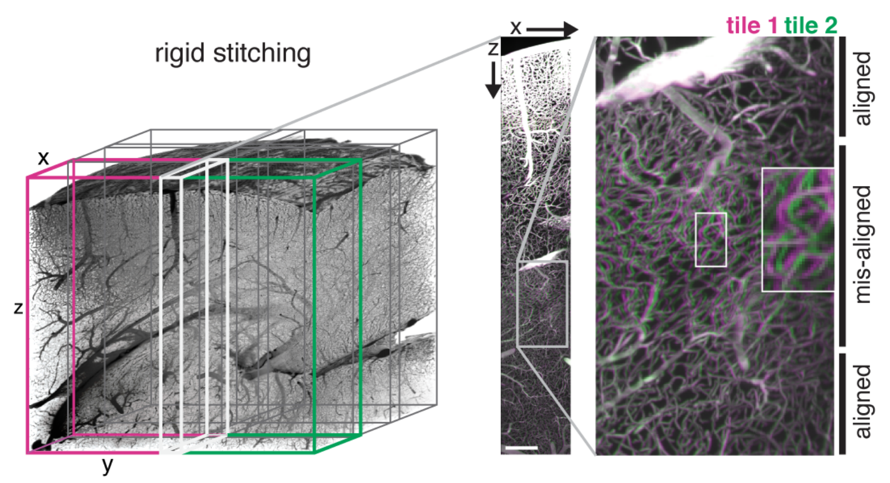
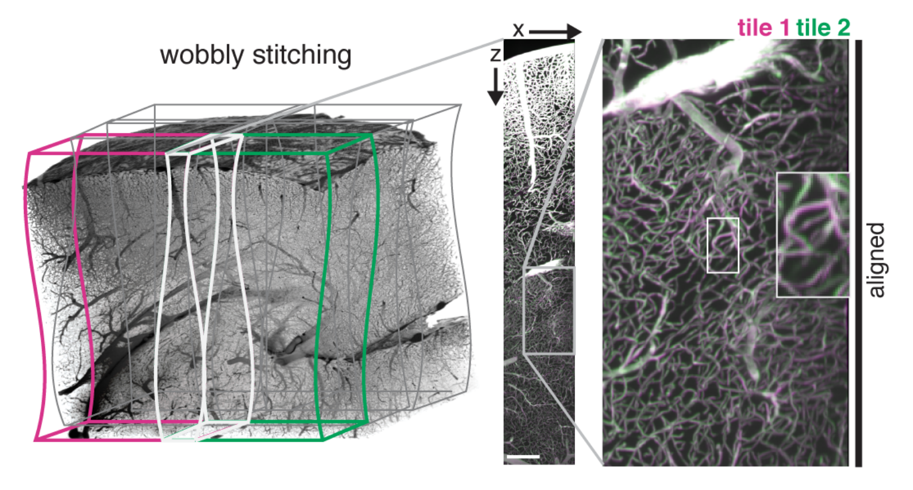

.. _wobbly_stitcher:

WobblyStitcher
==============

*ClearMap* includes *WobblyStitcher* that enables non-rigid stitching of 
large volumetric datasets.

The main purpose of *WobblyStitcher* is to remove stitching artifacts that 
arise from non-straight or *wobbly* stacks.

When stitching wobbly stacks in a rigid way the wobbliness can 
lead to artifacts at different levels along the wobble axis: 

   
*ClearMap's* *WobblyStitcher* compensates for this by aligning the stack 
non-rigidly along the wobble axis:

   
   
In brief *WobblyStitcher* works by 
  1. aligning pairs of stacks in the wobble axis using a maximal 
     intensity projection (MIP),
  2. determining good alignments for the individual planes,
  3. tracing the best alignment for the planes, 
  4. aligning all the planes in a globally optimal way.
  
 .. image:: ../static/WobblyStitcher_pipeline.jpg
   :width: 300  
   :align: center
    
Motivation
----------

Our method to acquire isotropic data via light-sheet imaging produces a
large number of tiles that have to be aligned and stitched. For accurate
reconstruction of the vasculature network at the vasculature capillary
level a precise and robust alignment of large data sets is needed.

Existing stitching tools for large data sets could not generate accurate
stitching results for our data sets due to misalignments arising from
the placement methods (TeraStitcher) or large data reading and writing
(BigStitcher). Even for well-placed tiles, rigid stitching produced
object duplications in sub-regions along the z-axis indicating x-y
movements of the images along this axis. Those movements likely
originate from imprecise stage movements and were found on different
microscopes and are prevalent in other data sets from other labs
(personal communication from Pablo Ariel, University of North Carolina).
To solve these problems, we developed WobblyStitcher, an open-source
software tool for robust and non-rigid stitching of terabyte data sets.

Method
------

WobblyStitcher uses three main steps to stitch the data: 
   (i) alignment,
   (ii) placement,
   (iii) stitching. 
   
In the alignment step the non-rigid displacements between images are estimated 
along with additional quality measures of the alignment reliability. In the 
placement step a combination of tracking and optimization tools is used to 
robustly position individual tiles within a global image frame. Finally, the 
stitching step uses 3D interpolation methods in the overlapping regions to 
compose the final volumetric image.

The 3D non-rigid alignment is done in three sub-steps: 
  (a) rigid alignment of the tiles along the axis orthogonal to the light 
      sheet plane (z-axis), 
  (b) placement of the tiles along this axis, followed by 
  (c) non-rigid alignments within each plane (x-y planes).

While a full non-rigid 3D alignment is possible by employing for example
non-linear registration methods (e.g. `elastix <http://elastix.isi.uu.nl/>`)
we did not find this necessary for our data sets. *WobblyStitcher* is 
targeted towards light-sheet images and optimized for fast processing
of terabyte-sized data sets. 

Rigid alignment
^^^^^^^^^^^^^^^

In the first step, neighboring tiles are rigidly aligned along the
z-axis. To speed up this step, a max-intensity projection (MIP) is
calculated along the axis that connects the two tiles and the alignment
is performed on the resulting 2d images. While WobblySticher implements
full 3d rigid alignment, we did not find this necessary for our data
sets in this step and opted for the faster MIP version.

The n-dimensional rigid alignment is done via minimizing the mean square
difference between the pixel intensities of two images :math:`I_{i}` and
:math:`I_{j}` over all possible n-dimensional displacements :math:`s` in
the overlap region :math:`O_{\text{ij}}(s)` as

.. math:: s_{\text{ij}}^{8} = \mathop{\mathrm{argmin}}_s {S_{\text{ij}}(s)}

with

.. math:: S\left( s \right) = \frac{1}{N_{\text{ij}}(s)}\sum_{x \in O_{\text{ij}}(s)}^{}\left( I_{i}\left( x \right) - I_{j}(x + s) \right)^{2}

where
:math:`N_{\text{ij}}\left( s \right) = \left| O_{\text{ij}}(s) \right|\ `
is the number of pixels in the overlap. We set
:math:`S_{\text{ij}}\left( s \right) = \infty` if there is no overlap,
i.e. :math:`N_{\text{ij}}\left( s \right) = 0`. This estimate allows for
a fast implementation via Fast Fourier Transform.

WobblyStitcher implements correlation or normalized cross-correlation
measures to estimate the shifts. In addition, other more sophisticated
measures to estimate the displacements exists (Klein et al., 2010) but
are not implemented in WobblyStitcher yet, as we did not find those
necessary to align our data sets.

Differences in high intensity voxels will contribute strongly to the
error measure :math:`S` above and can induce unwanted fluctuations, thus
WobblyStitcher gives an option to preprocess the images before
calculating the alignment. Arbitrary preprocessing routines can be
passed. For the brain vasculature preprocessing includes clipping at
specified intensity values above a threshold :math:`\theta_{h}` and
below :math:`\theta_{l}` as well as normalizing the images by
subtracting the mean and dividing by the standard deviation in the
overlap regions.

In addition, the alignment estimates :math:`s_{\text{ij}}^{*}` can be
corrupted in regions without or very little foreground signal as
background noise is aligned in this situation. WobblyStitcher provides
the option to pass a validation routine to the alignment and to measure
the quality of the alignment to prevent this problem. For the brain
vasculature the validation is done on the raw data by requiring that the
number of foreground pixels in the overlap region exceeds a certain
fraction or minimal number of required valid pixels, i.e

.. math:: \left| \{\theta_{b} < x < \theta_{t}|x \in O_{\text{ij}}\left( 0 \right)\} \right| \geq n_{v}

where :math:`\theta_{b}` and :math:`\theta_{t}` are intensity thresholds
below or above pixels are considered as invalid for alignment.

To measure the quality of the alignments the following measure is used

.. math:: q_{\text{ij}}^{*} = \left\{ \begin{array}{ll} - S(s_{\text{ij}}^{*}) & \text{for\ valid\ alignments} \\  - \infty & \text{else.} \end{array} \right.

Optimal rigid placement
^^^^^^^^^^^^^^^^^^^^^^^

Having measured the displacements between all tiles along the z-axis a
placement along this axis is performed. For this we use globally optimal
placement strategy to find the position :math:`p_{i}` for each tile
:math:`i` by minimizing the error term

.. math:: E = \sum_{(i,j) \in P}^{}\left( p_{i} + s_{\text{ij}} - p_{j} \right)^{2}

with respect to the positions :math:`p_{i}`. Here :math:`P` is the set
of pairs of indices :math:`\left( i,j \right)\ `\ of all neighboring
tiles for which the alignment quality
:math:`q_{\text{ij}}^{*} > \theta_{q}` exceeded a certain quality
threshold :math:`\theta_{q}`. The resulting set of equations is solved
for the positions via the Penrose pseudo inverse. The equations can be
solved separately in each coordinate dimension to speed up computation
of full 3d rigid placements or to calculate the optimal alignment along
a single axis. More importantly, thresholding the alignment quality can
force the alignment graph (nodes given by the tiles and edges indicating
valid alignment pairs of tiles) to become disconnected. WobblyStitcher
accounts for this by optimizing each connected component individually.
For the brain vasculature the quality threshold is set to
:math:`\theta_{q} = - \infty` in the z-alignment step only separating
empty tiles from the brain sample.

Non-rigid alignment
^^^^^^^^^^^^^^^^^^^

In the final step every pair of tiles is aligned non-rigidly in the x-y
planes via a series of computations:

First, the overlap region for each pair of neighboring and already
z-aligned tiles is computed. The overlap region is validated via an
optional validation routine passed to WobblySticher. For the brain
vasculature we use foreground pixel counting as described above. The
overlap regions are also preprocessed as a whole using normalization.

Second, for each z-value in the overlap region slices of the tiles in
the x-y plane are taken and the alignment error :math:`S` defined above
computed for each slice. For the vasculature each slice is validated
again separately using raw data slices and a higher threshold for the
number of required valid pixels :math:`n_{v}`.

Third, the best displacements along the z-axis of the two tiles are
determined via tracking. The reason for this step is to achieve
robustness against errors that can occur as multiple local minima can
arise in the error landscape :math:`S` in data sets with repetitive
structures near the overlap region. When considering global minima
alone, this can create jumps in the displacements and errors in the
alignments. WobblyStitcher first creates a list of all local minima in
the error landscape :math:`S` (excluding pixel at the overlap border)
together with their quality measure :math:`q` for each x-y slice.
Invalid marked slices will separate continuous segments of valid slices
along z. For each continuous segment linear programming (Jonker and
Volgenant, 1987) is used to track the local minima resulting in
potential displacement paths through z. To find the full path in each
segment the longest potential path with best quality measure is selected
and all trajectories within that z-range of paths removed. Subsequently,
the next longest path with minimal alignment error is selected etc.
Valid slices that could not be assigned a displacement in this way will
be marked as untraced and invalid.

Fourth, an optional smoothing is applied to the segments of valid
displacements along the z-axis. For the vasculature we use convolution
with a Bartlett window to smooth the segments.

The total result of this alignment procedure is that tiles become
aligned in z and for each neighboring x-y plane a robust displacement is
determined together with markers for validity, quality and traceability.

Final Placement
^^^^^^^^^^^^^^^

In this second step the tiles are placed non-rigidly considering the
validity and quality of the displacement measure.

WobblyStitcher first use the quality based global optimal alignment
method described above to place the individual x-y planes in each
z-slice of the entire data set. For each slice this results in optimal
displacements of the connected components. We will refer to each of
these connected components in a single plane as cluster for simplicity
in the following.

In the second placement step, clusters are aligned optimally in the
entire image. To achieve this the connectivity structure between the
clusters is determined first by constructing a graph with clusters as
nodes and edges between two clusters if they are from subsequent
z-planes and overlap in the x-y plane. The connected components of
clusters in this graph are then aligned, by considering all
displacements between the clusters and optimizing the error function:

.. math:: E = \sum_{s}^{}{\sum_{i \in C_{s}}^{}{\sum_{j \in C_{s + 1}}^{}{\sum_{k \in C_{s,i} \cap \ C_{s + 1,j}}^{}\left( (p_{s,k} + d_{s,i}) - (p_{s + 1,k} + d_{s + 1,j}) \right)^{2}}}}

with respect to the unknown displacements :math:`d_{s,i}` for cluster
:math:`i` in slice :math:`s`. Here :math:`C_{s}` is the set of clusters
in slice s belonging to the connected component under consideration,
:math:`C_{s,i}` is the index set of all tiles of the cluster
:math:`\text{i\ }`\ in slice :math:`s`, and :math:`p_{s,k}` is the
already optimized valid position of the slice :math:`s` of tile
:math:`k`. The optimization is again performed via the pseudo inverse to
solve for the displacements\ :math:`\ d_{s,i}`. This results in optimal
cluster positions and consequently in optimal positions of the
individual image planes.

In a post-processing step, segments of untraceable or invalid slices of
tiles that are neighboring valid slices in the z-axis are positioned
using linear interpolation between the positions of the valid slices.
Finally, the displacements along the z-axis are smoothed again via
convolution with a Bartlett window.

To speed up computation in large data sets WobblyStitcher implements the
option to perform the alignment and placement only on a subset or
sub-grid of z-planes and fill in the skipped slices via interpolation.

Stitching
^^^^^^^^^

In this final step the tiles are combined into a single image. Stitching
is done in each z-slice separately by using the optimized positions of
the individual tile slices and their shapes to determine the various
regions of overlaps together with the tile slices contributing to each
of those regions. In addition, for each pixel in each tile slice the
distance to the border of that tile slice is determined and passed as a
weight for each overlap region to the actual stitching function.
WobblyStitcher implements a set of stitching functions, such as maximum,
minimum or mean projections as well as interpolations using the pixel
weights. Also custom defined stitching functions can be passed. For the
vasculature we use a weighted mean using the distance to the border as a
weight.
