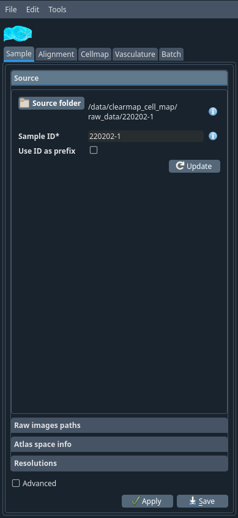
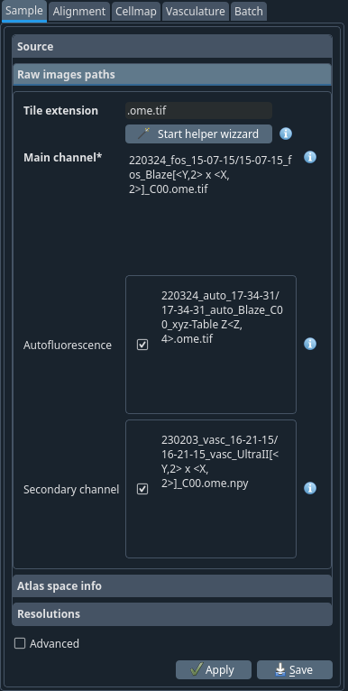
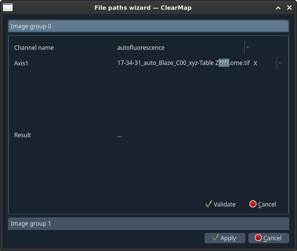
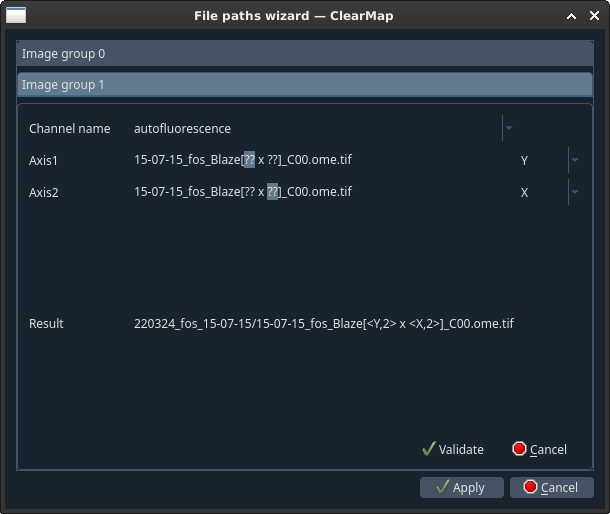
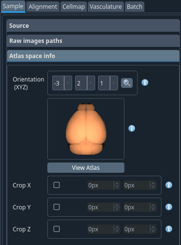
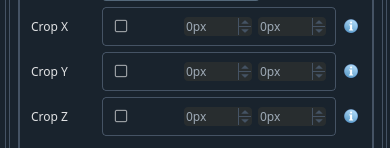
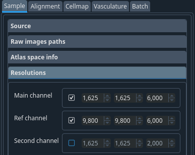

Menu Sample
-----------

Source -> Raw images paths -> Atlas space info ->
Resolutions

Source tab
~~~~~~~~~~

Source folder
    *This should be the main folder of the sample, not the
    sub-folder containing e.g. the raw data as all files will be read from
    and saved to this folder.*

    Select the folder where you have both autofluorescence (1x) and the raw
    (e.g. cFos) (4x) data folders for a brain.

Sample ID
    *The ID of the sample.* write the name of your sample this is
    the identifier for the sample. *Any string (ideally short) containing
    alphanumerical characters and underscores. It is important that this ID
    remains unique within a study as this will be used to identify samples
    in the summary.*

Click on the update button. If you already have the config files, it
will automatically retrieve your sample's name. If not, it will ask you
if you want to get some config files by default. Accept it.

.. container:: clearer

    .. image:: images/clearer.png

For cell detection, choose **CellMap** as your data analysis type, for
vasculature, choose **TubeMap**. If you have mixed data, you can select
**Both**.

You will get the following files in your source folder:

-  alignment_params.cfg
-  cell_map_params.cfg
-  sample_params.cfg
-  errors.html
-  info.log

Raw images path tab
~~~~~~~~~~~~~~~~~~~

Tile extension:
    .ome.tif The file extension of the individual tiles.
    This is used by the helper wizard to search for the images.

Start helper wizard
    Launch the paths helper wizard popup window. This will open a new window
    with a wizard to help you construct the patterns for the paths.

    For each channel:
        - Select what type this channel is (autofluorescence, raw,...) [#]_
        - For each group of digits highlighted as question marks, select the
            corresponding axis from the drop-down menu.
        - Click **Validate**.
        - Once done, click **Apply**.

Main channel
    The main channel colour of your sample. This is usually
    the channels with cells or vessels.

Autofluorescence
    The reference channel. This is the channel that will be used for atlas alignment.

Secondary channel
    Secondary data channel

.. [#] Info for all the individual channels: This is a relative path (from the
    sample directory) and the channels digits are written as follows *<Axis,
    n_digits>* with axis begin one of XYZ in caps. The number of digits
    include the number of 0.

|wizard_auto| |wizard_raw|
    Helper wizard (new pop window)

The autofluorescence channel should be 1x The raw channel should be 4x
You can confirm it by checking the objective used

After clicking **Apply**, the channels should be automatically updated.

Atlas space info tab
~~~~~~~~~~~~~~~~~~~~

Orientation (XYZ)
    The order in which are represented the X, Y and Z channels.
    The orientation (XYZ) of your sample based on the orientation you
    put on the microscope when compared to the Allen Brain Atlas. Once selected,
    click on the magnifying glass to view the result. This is a sketch
    of the sample as it was oriented during the scan.  *Example: Orientation -1 2 3*

.. NOTE::
    A minus sign indicates an inversion of the axis direction.

.. WARNING::
    Do not select the same order for multiple axes.

How to crop the atlas along the axes to match the sample.

Crop your image if you only acquired part of the brain (e.g.
half an hemisphere). In case where you would be scanning half a brain,
it is a good idea to leave a bit more than the midline to improve
alignment. Leave the axes that were not cropped un-ticked.

.. container:: clearer

    .. image:: images/clearer.png

Crop X
    Select as appropriate from the the reference atlas

Crop Y
    Select as appropriate from the the reference atlas

Crop Z
    Select as appropriate from the the reference atlas
    If you have only half hemisphere, you would typically
    cut at 270 px in z

.. NOTE::
    Values are in pixels. To select the appropriate values, click on the
    **open atlas** button.

------------------------------------------------------------------------

Resolutions tab
~~~~~~~~~~~~~~~

Resolution of the raw dataset. This is the physical size of a voxel in
um. These values depend on the microscope and the step size you are
using to image.

.. container:: clearer

    .. image:: images/clearer.png

.. TIP::
    Planned development
        in future versions, leaving this unselected while the channel is
        enabled in the paths tab will make the software read the value from the metadata.

.. NOTE::
    To be sure you can check these values on FIJI. Take the first
    image (that is where the metadata is stored) from your autofluorescence
    channel -> load it on FIJI, go to Image -> Show info -> Pixels ID ->
    Physical size -> Get the info

Once all the values have been entered for the sample tab, click
**Apply**. You will then be prompted to *“Convert individual tiles to
npy for efficiency ?”* this will create a copy of the tiles in the python
*.npy* format. It will make the stitching process a bit faster but use
more space on the hard drive.
